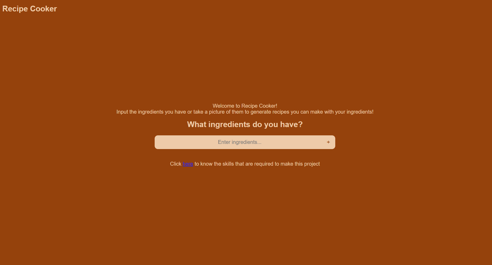

# ChefAI - AI-Powered Recipe Generator
ChefAI is a web application that helps users generate recipes based on the ingredients they have at home. 
Whether you're an inexperienced cook or looking for creative meal ideas, ChefAI provides AI-generated recipes tailored to your available ingredients.
Adding an screenshot or a mockup of your application in action would be nice.  


# How to run
To run the ChefAI locally:
1. Ensure Python3 is installed on development computer  
2. Fork repository
3. Git clone repository
4. Create a virtual enironment using command:
```
a. python3 -m venv myenv  
```
5. Activate the virtual enironment with command
- For mac0S/Linux:
```
a. source myenv/bin/activate
```
- For Windows:
```
a. myenv\Script\Activate
```
6. Navigate to the folder that has the file requirements.txt and type the command:
```
a. pip install -r requirements.txt
```
7. Start local server by typing the command:
```
a. python3 manage.py runserver
```
8. Visit http://127.0.0.1:8000

# How to contribute
Follow this project board to know the latest status of the project: [https://github.com/orgs/cis3296s25/projects/58]([https://github.com/orgs/cis3296s25/projects/58])  

### How to build
- Use this github repository: [https://github.com/cis3296s25/01-ChefAI]([https://github.com/cis3296s25/01-ChefAI])
- Use the `main` branch for the latest stable release:
```
git checkout main
```
- All required dependencies are listed in `requirements.txt`. Install them with:
```
a. pip install -r requirements.txt
```
- To start the application, run:
```
a. python manage.py runserver
```
- The Django development server should start, and you should be prompted to go to:
```
http://127.0.0.1:8000/    
```

